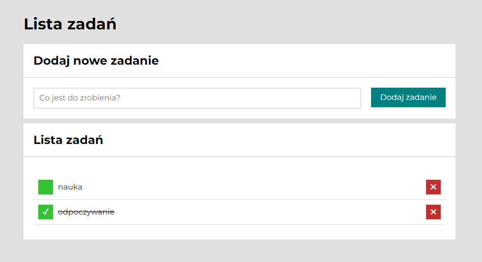

# list-of-tasks

## Description

Having troubles with organizing your job? Here's a newly designed tool to help you manage dealing with upcoming and performed events - a list of tasks enabling users to tick done and awaiting tasks!

## Features

ES6+
HTML
JavaScript
CSS
BEM convention
Normalize
GIT
Grid

### Demo 

https://jacob-jk.github.io/list-of-tasks/
